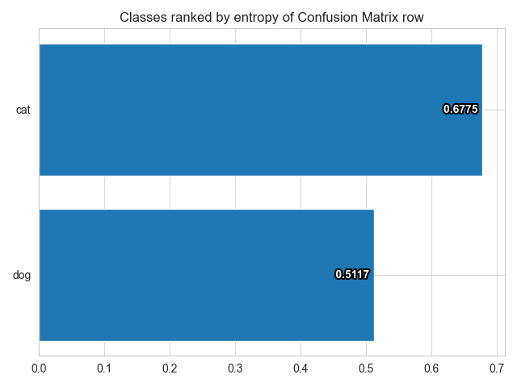
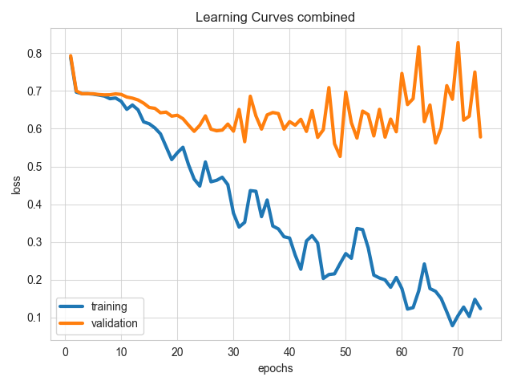

# ludwig-cat-dog-classifier
An example how to use ludwig to classify images.


[What is Ludwig?](https://ludwig.ai/late)

# Env preparate
First thing you need to do is preparate the enviroiment, installing ludwig, etc.

To this porpose I recoment to create a new env:
```
  python -m venv venv
```

Activate the env and installing ludwig
```
  python -m pip install --upgrade pip &&  python -m pip install ludwig
```
# Dataset

Ludwig can train on any table-like dataset, meaning that every feature has its own column and every example its own row.

# Configuration
This is a important aspect when using ludwig I put a configuration file in this repository: config.yaml. For more detaled information please see the oficial documentation [Configuration](https://ludwig.ai/latest/configuration/) 

# Train

Ludwig train command:
```bash
ludwig train \
  --dataset cats-dogs.csv \
  --config config.yaml
```
# Evaluate

Ludwig evaluate command:
```bash
ludwig evaluate --model_path results/experiment_run_1/model \
                 --dataset cats-dogs.csv \
                 --split test \
                 --output_directory test_results
```
# Visualize Metrics

Do some matrix like confusion matrix
```bash
ludwig visualize --visualization confusion_matrix \
                  --ground_truth_metadata results/experiment_run_1/model/training_set_metadata.json \
                  --test_statistics test_results/test_statistics.json \
                  --output_directory visualizations \
                  --file_format png
```




Generate some learing curves
```bash
ludwig visualize --visualization learning_curves \
                  --ground_truth_metadata results/experiment_run/model/training_set_metadata.json \
                  --training_statistics results/experiment_run/training_statistics.json \
                  --file_format png \
                  --output_directory visualizations
```



As you can notice the model is not so good and is very overfited. Fell free to improve this model adding some dropout and other things. It's only a example of how to use.


# Predictions
```
ludwig predict --model_path results/experiment_run/model \
                --dataset cats-dogs.csv \
                --split test \
                --output_directory predictions
```


# Using pretrained model 

You can find all available Pretrained models at (here)[https://ludwig.ai/latest/configuration/features/image_features/]. To use this models you can add the model you want inside the config file as config_pretrained.yaml I put in this repo.
